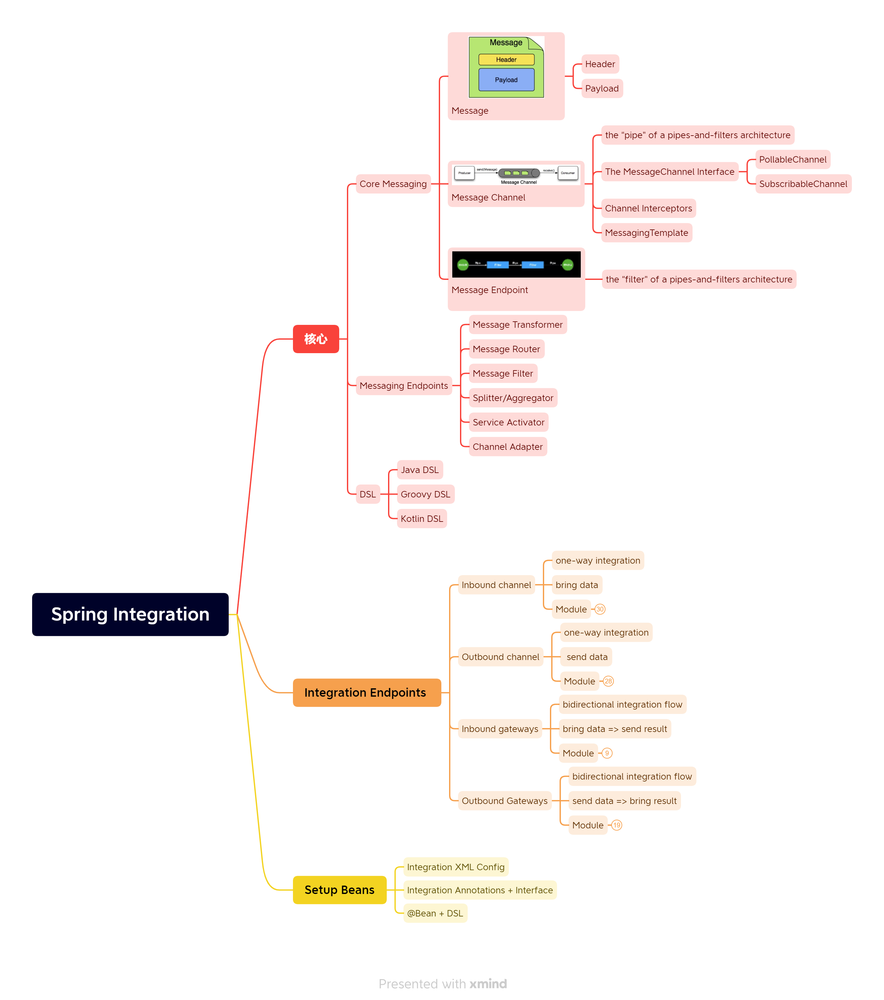

# Spring-Integration-Tips

## Introduce

This project contains tips of Spring Integration with Spring-boot.
If you want to find some example about Integration with Spring, follow this [link](https://github.com/spring-projects/spring-integration-samples/).

## MindMap

## Todo

- [ ] kt apps
- [ ] Groovy apps
  - [ ] script
  - [ ] script + XML 
- [ ] SpringBoot example
  - [ ] DSL
  - [ ] annotation
  - [ ] XML